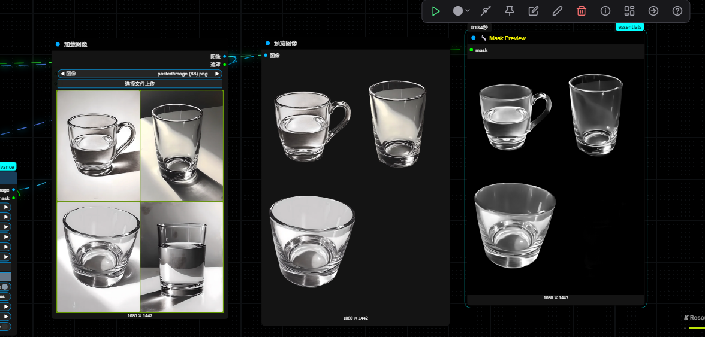
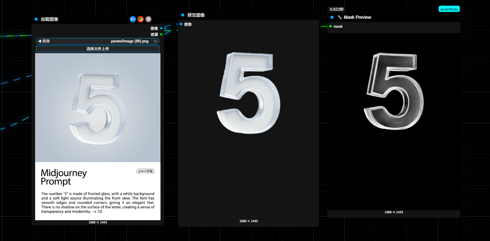

# ComfyUI-SDMatte

[English](README_CN.md) | 简体中文

基于 [SDMatte](https://github.com/vivoCameraResearch/SDMatte) 的 ComfyUI 自定义节点插件，用于交互式图像抠图。

## 🚀 快速开始

> 📺 **视频教程**：[ComfyUI-SDMatte 使用教程](https://www.bilibili.com/video/BV1L6bzz8Ene/?spm_id_from=333.1387.homepage.video_card.click&vd_source=b340fd050dbe0d3e2ce863af909f1ee8)  
> 🔧 **示例工作流**：[高级抠图与遮罩优化工作流](https://www.runninghub.ai/post/1955928733028941826?inviteCode=rh-v1041)  
> 💡 **推荐**：先观看视频教程了解使用方法，再下载工作流进行实践

## 📖 简介

SDMatte 是一个基于稳定扩散（Stable Diffusion）的交互式图像抠图方法，由 vivo 摄像研究团队开发，已被 ICCV 2025 接收。该方法利用预训练扩散模型的强大先验知识，支持多种视觉提示（点、框、掩码）来精确提取自然图像中的目标对象。

本插件将 SDMatte 集成到 ComfyUI 中，提供简洁易用的节点接口，专注于 trimap 引导的抠图功能，并内置了多种 VRAM 优化策略。

## 🖼️ 示例

### 抠图效果

<table>
  <tr>
    <td align="center"><strong>原始图像</strong></td>
    <td align="center"><strong>三值图</strong></td>
    <td align="center"><strong>抠图结果</strong></td>
  </tr>
  <tr>
    <td></td>
    <td></td>
    <td><em>Alpha 遮罩输出</em></td>
  </tr>
</table>

*示例工作流展示了 SDMatte 基于三值图引导的高精度抠图能力。*

## ✨ 特性

- 🎯 **高精度抠图**：基于扩散模型的强大先验，能够处理复杂边缘细节
- 🖼️ **Trimap 引导**：支持三值图（trimap）引导的精确抠图
- 🚀 **VRAM 优化**：内置混合精度、注意力切片等多种显存优化策略
- 🔧 **ComfyUI 集成**：完全兼容 ComfyUI 工作流系统
- 📥 **模型自动下载**：首次使用时自动下载模型权重
- 📱 **灵活尺寸**：支持多种推理分辨率（512-1024px）

## 🛠️ 安装

### 1. 下载插件

将本插件放置到 ComfyUI 的自定义节点目录：

```bash
cd ComfyUI/custom_nodes/
git clone https://github.com/flybirdxx/ComfyUI-SDMatte.git
```

### 2. 安装依赖

ComfyUI 会在启动时自动安装 `requirements.txt` 中的依赖包：

- diffusers
- timm
- einops
- lazyconfig

### 3. 自动模型下载

**无需手动下载模型。**

首次使用 `Apply SDMatte` 节点时，它会自动检查并从 Hugging Face 下载所需的模型权重。模型将被存放在：
`ComfyUI/models/SDMatte/`

您可以直接在节点内选择使用标准版 (`SDMatte.pth`) 或增强版 (`SDMatte_plus.pth`)。

### 4. 重启 ComfyUI

重启 ComfyUI 以加载新的自定义节点。

## 🎮 使用方法

### 节点说明

#### Apply SDMatte（SDMatte 应用）

- **功能**：在一个节点内完成模型加载和抠图应用。
- **输入**：
  - `ckpt_name`：选择要使用的模型（`SDMatte.pth` 或 `SDMatte_plus.pth`）。如果本地不存在，将自动下载。
  - `image`：输入图像（ComfyUI IMAGE 格式）
  - `trimap`：三值图掩码（ComfyUI MASK 格式）
  - `inference_size`：推理分辨率（512/640/768/896/1024）
  - `is_transparent`：图像是否包含透明区域
  - `output_mode`：输出模式（`alpha_only`, `matted_rgba`, `matted_rgb`）
  - `mask_refine`：启用遮罩优化以减少背景干扰
  - `trimap_constraint`：用于优化的三值图约束强度
  - `force_cpu`：强制使用 CPU 推理（可选）
- **输出**：
  - `alpha_mask`：抠图结果的 alpha 遮罩
  - `matted_image`：抠图后的图像结果

### 基础工作流

1. **Load Image**：加载需要抠图的图像
2. **创建 Trimap**：使用绘图工具或其他节点创建三值图
   - 黑色（0）：确定背景
   - 白色（1）：确定前景  
   - 灰色（0.5）：未知区域
3. **Apply SDMatte**：应用抠图
4. **Preview Image**：预览抠图结果

### 推荐设置

- **推理分辨率**：1024（最高质量）或 768（平衡性能）
- **透明标志**：根据输入图像是否有透明通道设置
- **强制 CPU**：仅在 GPU 显存不足时使用

## 🔧 技术细节

### 数据处理

- **输入图像**：自动调整到推理分辨率，归一化到 [-1, 1]
- **Trimap**：调整到推理分辨率，映射到 [-1, 1] 范围
- **输出**：调整回原始分辨率，clamp 到 [0, 1] 范围

### VRAM 优化

插件内置多种显存优化策略（自动启用）：

- **混合精度**：使用 FP16 autocast 减少显存占用
- **注意力切片**：SlicedAttnProcessor(slice_size=1) 最大化显存节省
- **显存清理**：推理前后自动清理 CUDA 缓存
- **设备管理**：智能的设备分配和模型移动

### 模型加载

- **权重格式**：支持 .pth 和 .safetensors 格式
- **安全加载**：处理 omegaconf 对象，支持 weights_only 模式
- **嵌套结构**：自动处理复杂的 checkpoint 结构
- **错误恢复**：多重fallback机制确保加载成功

## ❓ 常见问题

### Q: 节点无法被搜索到？
A: 确保插件目录结构正确，重启 ComfyUI，检查控制台是否有错误信息。

### Q: 模型加载失败？
A: 检查 SDMatte.pth 文件路径，确保基础模型目录结构完整，查看控制台详细错误信息。

### Q: 推理时显存不足？
A: 尝试降低推理分辨率，启用 `force_cpu` 选项，或关闭其他占用显存的程序。

### Q: 抠图效果不理想？
A: 优化 trimap 质量，确保前景/背景/未知区域标注准确，尝试不同的推理分辨率。

### Q: 首次推理很慢？
A: 首次运行需要编译 CUDA 内核，后续推理会显著加速。

### Q: 应该选择哪个模型版本？
A: 
- **SDMatte.pth（标准版）**：文件较小（~11GB），推理速度快，适合大多数场景
- **SDMatte_plus.pth（增强版）**：文件较大，精度更高，适合对质量要求极高的专业用途
- 建议先使用标准版测试，如需更高质量再升级到增强版

## 📋 系统要求

- **ComfyUI**：最新版本
- **Python**：3.8+
- **PyTorch**：1.12+ （支持 CUDA 推荐）
- **显存**：8GB+ 推荐（支持 CPU 推理）
- **依赖**：diffusers, timm, einops, lazyconfig

## 📝 版本更新日志

### v1.3.0 (2025-08-17)
- ✨ **新增功能**：
  - 实现模型自动下载与检查功能，模型现在存放于 `ComfyUI/models/SDMatte/` 目录。
- 🔧 **优化改进**：
  - 将 `SDMatte Model Loader` 和 `SDMatte Apply` 节点合并为单一的 `Apply SDMatte` 节点，简化了工作流。
  - 重构了部分代码，提升稳定性。

### v1.2.0 (2025-08-15)
- ✨ **新增功能**：
  - 添加图像输出，同时输出alpha遮罩和抠图结果
  - 支持透明背景抠图模式
  - 添加多种输出模式：`alpha_only`、`matted_rgba`、`matted_rgb`
  - 新增遮罩优化功能，使用trimap约束过滤不需要的区域
  - 添加 `trimap_constraint` 参数控制约束强度
  - 为所有参数添加详细的tooltip说明
- 🔧 **优化改进**：
  - 改进alpha遮罩处理逻辑，减少背景干扰
  - 优化前景区域提取算法
  - 增强低置信度区域过滤机制
- 📚 **文档更新**：
  - 添加示例工作流链接
  - 添加视频教程链接
- 🔧 **优化改进**：
  - 改进VRAM优化策略
  - 增强模型加载稳定性
  - 优化推理性能

### v1.0.0 (2025-08-14)
- 🎉 **初始版本**：
  - 基础SDMatte模型集成
  - 支持trimap引导抠图
  - 内置VRAM优化功能
  - 支持多种推理分辨率

## 📚 参考

- **示例工作流**：[高级抠图与遮罩优化工作流](https://www.runninghub.ai/post/1955928733028941826?inviteCode=rh-v1041)
- **视频教程**：[ComfyUI-SDMatte 使用教程](https://www.bilibili.com/video/BV1L6bzz8Ene/?spm_id_from=333.1387.homepage.video_card.click&vd_source=b340fd050dbe0d3e2ce863af909f1ee8)
- **原始论文**：[SDMatte: Grafting Diffusion Models for Interactive Matting](https://arxiv.org/abs/2408.00321) (ICCV 2025)
- **原始代码**：[vivoCameraResearch/SDMatte](https://github.com/vivoCameraResearch/SDMatte)
- **模型权重**：[LongfeiHuang/SDMatte](https://huggingface.co/LongfeiHuang/SDMatte)

## 📄 许可证

本项目遵循 MIT 许可证。原始 SDMatte 项目同样使用 MIT 许可证。

## 🙏 致谢

感谢 vivo 摄像研究团队开发的优秀 SDMatte 模型，以及 Stable Diffusion、ComfyUI 社区的贡献。

## 📧 支持

如有问题或建议，请在 GitHub 上提交 Issue。

---

**注意**：本插件为第三方实现，与原始 SDMatte 团队无直接关联。使用前请确保遵循相关许可证条款。