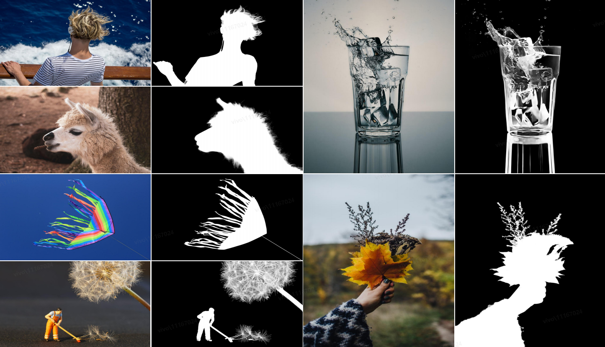
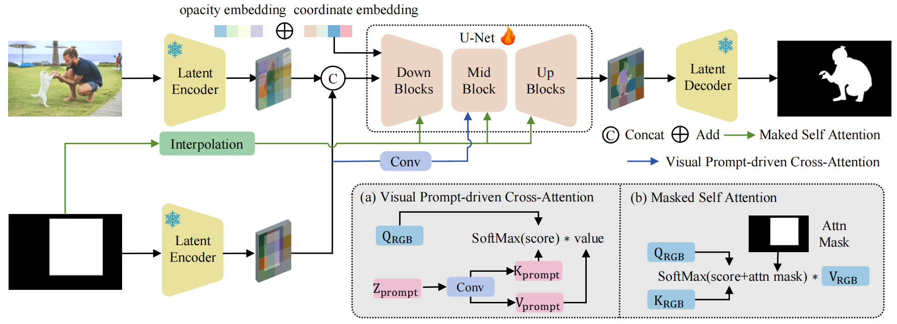
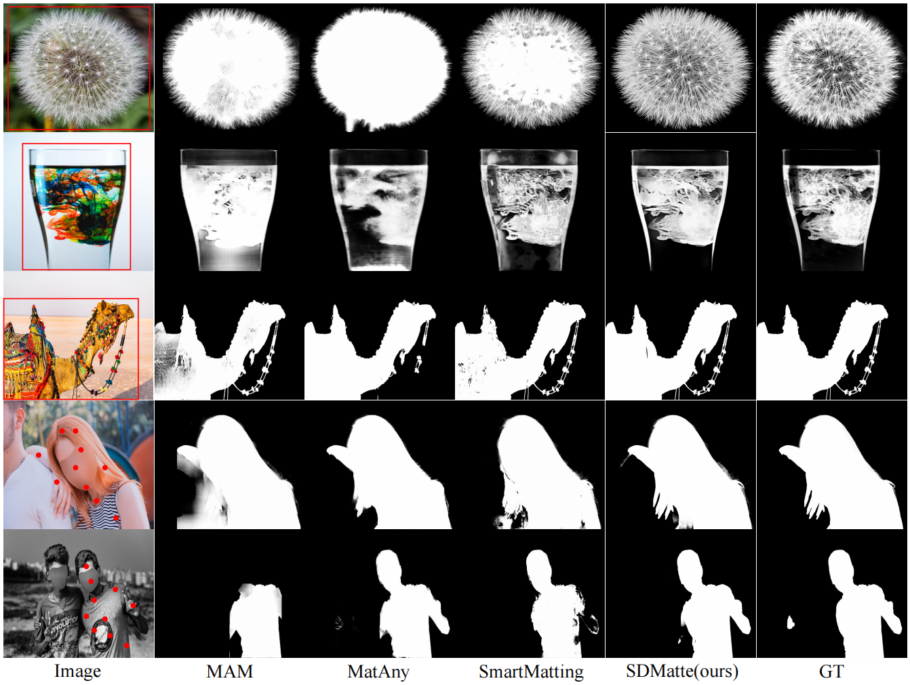

<div align="center">
  <p align="center">
    
  </p>

  <h1 align="center">Grafting Diffusion Models for Interactive Matting</h1>

  <p align="center">
    <b>
      Longfei Huang<sup>1,2*</sup>, Yu Liang<sup>2*</sup>, Hao Zhang<sup>2</sup>,
      Jinwei Chen<sup>2</sup>, Wei Dong<sup>2</sup>,<br>
      Lunde Chen<sup>1</sup>, Wanyu Liu<sup>1</sup>, Bo Li<sup>2</sup>,
      Peng-Tao Jiang<sup>2†</sup>
    </b><br>
    <sup>1</sup> Shanghai University &nbsp;&nbsp;&nbsp;
    <sup>2</sup> vivo Mobile Communication Co., Ltd.<br>
    <sup>*</sup> Equal contribution &nbsp;&nbsp;&nbsp;
    <sup>†</sup> Corresponding author
  </p>

  [](https://github.com/vivoCameraResearch/SDMatte)
  [](https://arxiv.org/abs/2508.00443)
  [](https://opensource.org/license/MIT)
  [](https://huggingface.co/LongfeiHuang/SDMatte)
  [](https://github.com/vivoCameraResearch)

  <strong><i>SDMatte</i> is an interactive image matting method based on stable diffusion, which supports three types of visual prompts (points, boxes, and masks) for accurately extracting target objects from natural images.</strong>

  <div style="width: 100%; text-align: center; margin:auto;">
      
  </div>
</div>

## 📢 News
- [2025.08.04] Released evaluation codes. 
- [2025.08.01] Published the [arXiv preprint](https://arxiv.org/abs/2508.00443).  
- [2025.07.31] This repo is created. 
- [2025.06.26] Paper accepted by ICCV 2025.

## 📖 Overview
### Abstract

Recent interactive matting methods have demonstrated satisfactory performance in capturing the primary regions of objects, but they fall short in extracting fine-grained details in edge regions. Diffusion models trained on billions of image-text pairs, demonstrate exceptional capability in modeling highly complex data distributions and synthesizing realistic texture details, while exhibiting robust text-driven interaction capabilities, making them an attractive solution for interactive matting. 
To this end, we propose SDMatte, a diffusion-driven interactive matting model, with three key contributions.
First, we exploit the powerful priors of the pre-trained U-Net within diffusion models and transform the text-driven interaction mechanism into a visual prompt-driven interaction mechanism to enable interactive matting.
Second, we integrate coordinate embeddings of visual prompts and opacity embeddings of objects into U-Net, enhancing SDMatte's sensitivity to spatial position information and opacity information.
Third, we propose a masked self-attention mechanism and a visual prompt-driven interaction mechanism that enable the model to focus on areas specified by visual prompts, leading to better performance.
Extensive experiments on multiple datasets demonstrate the superior performance of our method, validating its effectiveness in interactive matting.

### Architecture

<div align="center">
  
</div><br/>

### Visualization

<div align="center">
  
</div>

## 🛠️ Installation

1. Create a conda virtual env and activate it.

    ```
    conda create -n SDMatte python==3.10
    conda activate SDMatte
    ```
2. Install packages.
    ```
    cd path/to/SDMatte
    pip install -r requirements.txt
    ```
3. Install [detectron2](https://github.com/facebookresearch/detectron2) , follow its [documentation](https://detectron2.readthedocs.io/en/latest/).
  For SDMatte, we recommend to build it from latest source code.
    ```
    python -m pip install 'git+https://github.com/facebookresearch/detectron2.git'
    ```

## 📂 Dataset

* To train **SDMatte** and **LiteSDMatte**, please prepare the following datasets: [Composition-1K](https://sites.google.com/view/deepimagematting), [DIS-646](https://github.com/yuhaoliu7456/CVPR2020-HAttMatting), [AM-2K](https://github.com/JizhiziLi/GFM), [UHRSD](https://github.com/iCVTEAM/PGNet), [RefMatte](https://github.com/jizhiziLi/rim), and [BG-20K](https://github.com/JizhiziLi/GFM).

* To train **SDMatte<sup>*</sup>**, please prepare the following datasets: [Composition-1K](https://sites.google.com/view/deepimagematting), [DIS-646](https://github.com/yuhaoliu7456/CVPR2020-HAttMatting), [AM-2K](https://github.com/JizhiziLi/GFM), [COCO-Matte](https://github.com/XiaRho/SEMat), and [BG-20K](https://github.com/JizhiziLi/GFM).

* To evaluate **SDMatte**, please prepare the following test datasets: [AIM-500](https://github.com/JizhiziLi/AIM), [AM-2K](https://github.com/JizhiziLi/GFM), [P3M-500](https://github.com/JizhiziLi/P3M), and [RefMatte-RW-100](https://github.com/jizhiziLi/rim).

* Check lines 15–56 and 529–530 in `SDMatte/data/dataset.py` to modify the data path to your data path.

## 🔍 Test

* Download the model weights from the Hugging Face repository [LongfeiHuang/SDMatte](https://huggingface.co/LongfeiHuang/SDMatte)

* Modify the `pretrained_model_name_or_path` field in `configs/SDMatte.py` to the directory path containing the configuration files, so that the model can be properly initialized.

* Modify the `CKPT_DIR` parameter in `script/test.sh` to the specific path of the downloaded weight file, and then run the script using `bash script/test.sh`.

## 📋 TodoList

- [x] Publish paper on arXiv  
- [x] Release source code for SDMatte  
- [x] Release evaluation codes  
- [ ] Release pretrained weights for SDMatte and SDMatte*  
- [ ] Release source code for LiteSDMatte  
- [ ] Release pretrained weights for LiteSDMatte  
- [ ] Release training code
- [ ] Deploy interactive demo using Gradio or on Hugging Face Spaces  

## 📝 License

This project is licensed under <a rel="license" href="./LICENSE">MIT</a>. Redistribution and use should follow this license.

## 👏 Acknowledgement

Our repo is built upon [Stable Diffusion 2](https://github.com/Stability-AI/stablediffusion), [TAESD](https://github.com/madebyollin/taesd), and [BK-SDM](https://github.com/Nota-NetsPresso/BK-SDM). We sincerely thank the authors for their contributions to the community.

## 📧 Contact

If you have any questions, please feel free to reach us at `2946399650fly@shu.edu.cn` or ` pt.jiang@vivo.com`. 